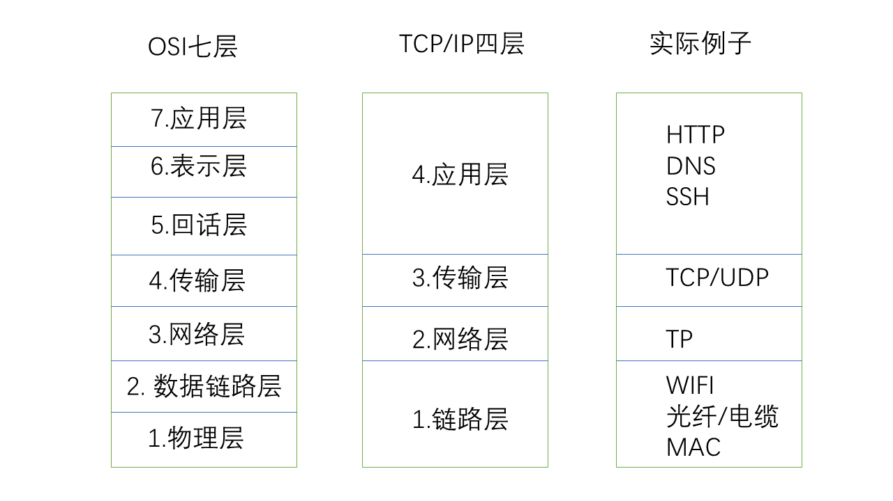

# 写在前面
### 当这个教程结束你能拥有
- 一台在世界某个地方的linux服务器
- 通过这台服务器科学上网（访问外网）
- 在这台服务器上运行一个C语言写的程序提供网页服务
- 你会拥有一个网址通过它来访问你的网站
- 学会创建项目和如何使用简单的git命令管理你的项目
# 网页简介
我们上网会先打开浏览器输入一个网址，浏览器会把这个网址装进http报文发送给dns服务器，这个dns服务器记录着**网址->IP**的映射关系，他会把对应的IP地址返回给你的浏览器，浏览器再把IP写进http报文发到（经过交换机）路由器（我们的网络其实就是世界各地的无数台路由器之间相互连接组成的巨大数据转发线路网），路由器查看他的路由转发表,转发表是一种**网址->路由出口**的映射关系表，就相当于是一张地图，指导着流量转发的方向。当报文发送到你的服务器后，服务器会查看端口号，发现是80（80是http默认端口号，当然你可以填其他，但是要和你的C程序中设置的一样）（当然建立TCP连接的时候要经历三次握手）就知道这是给你的C程序的。C程序拿到报文后开始解析http报头，比如报头是get img.png就知道是浏览器想要浏览你服务器上存储的img.png图片，然后C程序将img.png放进报文发送给浏览器。浏览器拿到图片后就会显示到界面上。（最后关闭tcp连接要进行三次挥手）

## 网络
计算机网络被分为七层或四层

## tcp是什么
简单的解释，tcp就是你的浏览器和提供网页的服务器直接进行的连接，它封装了刚才提到的网络的它就像一部电话