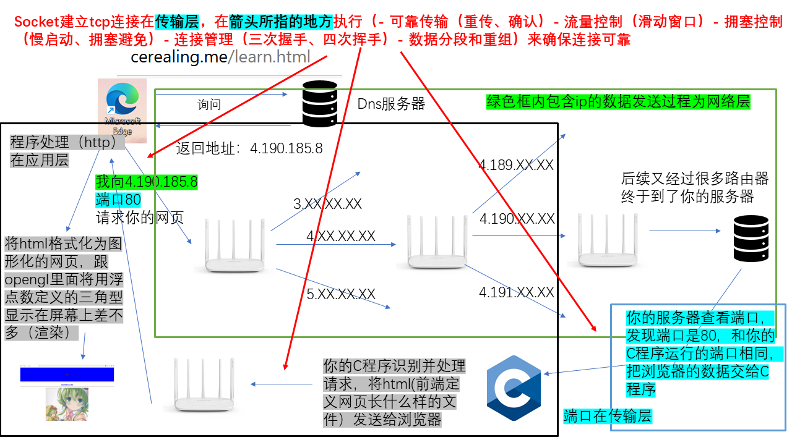
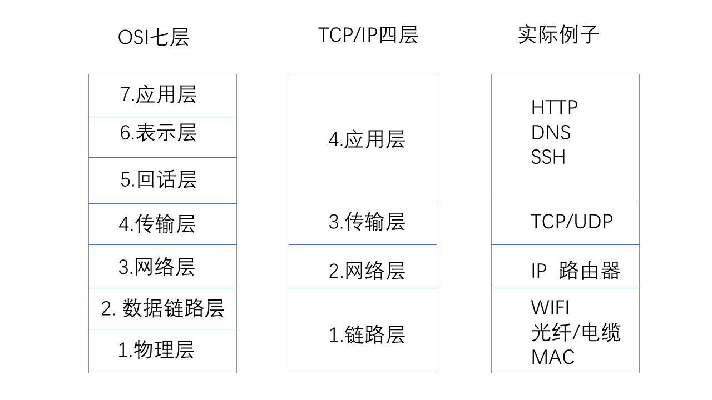
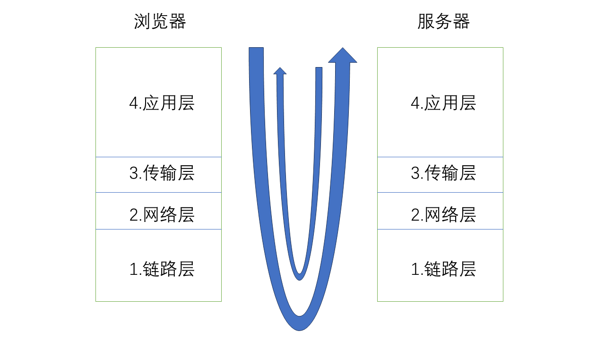
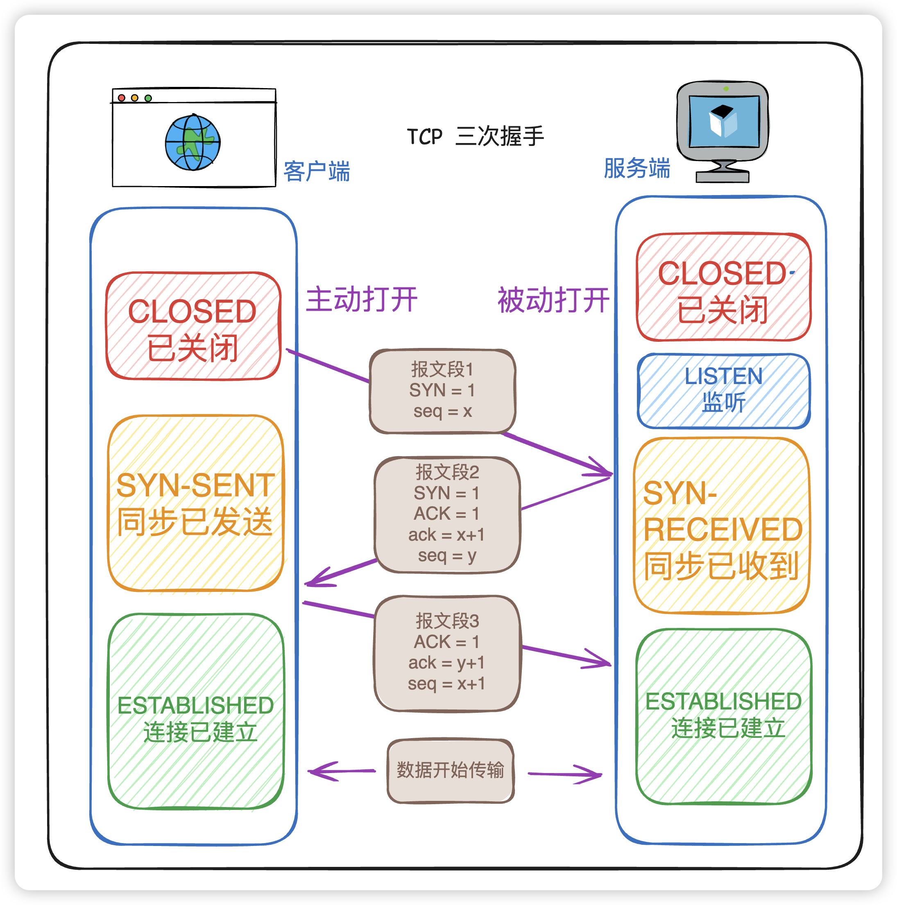
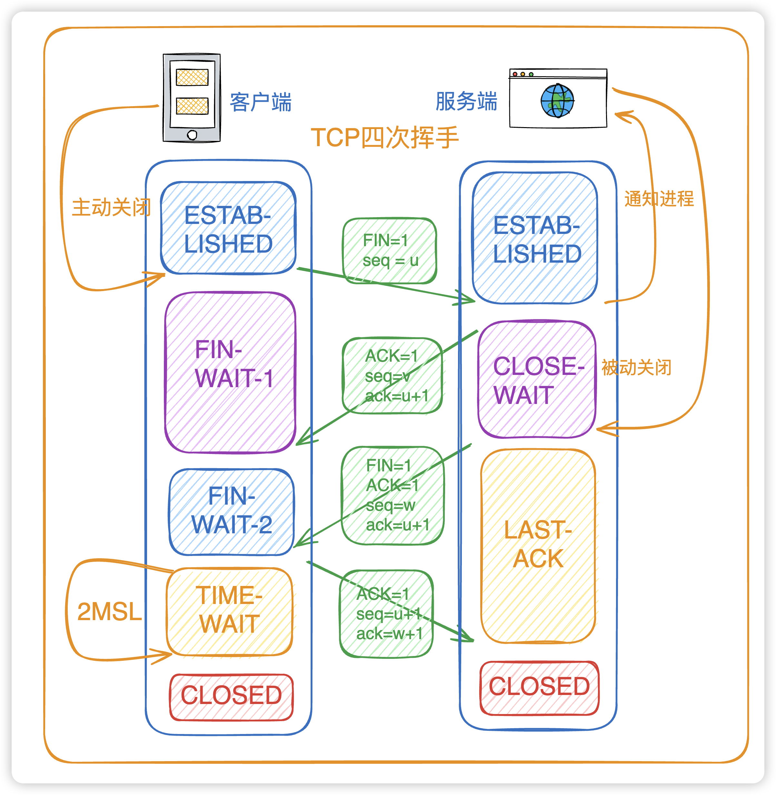
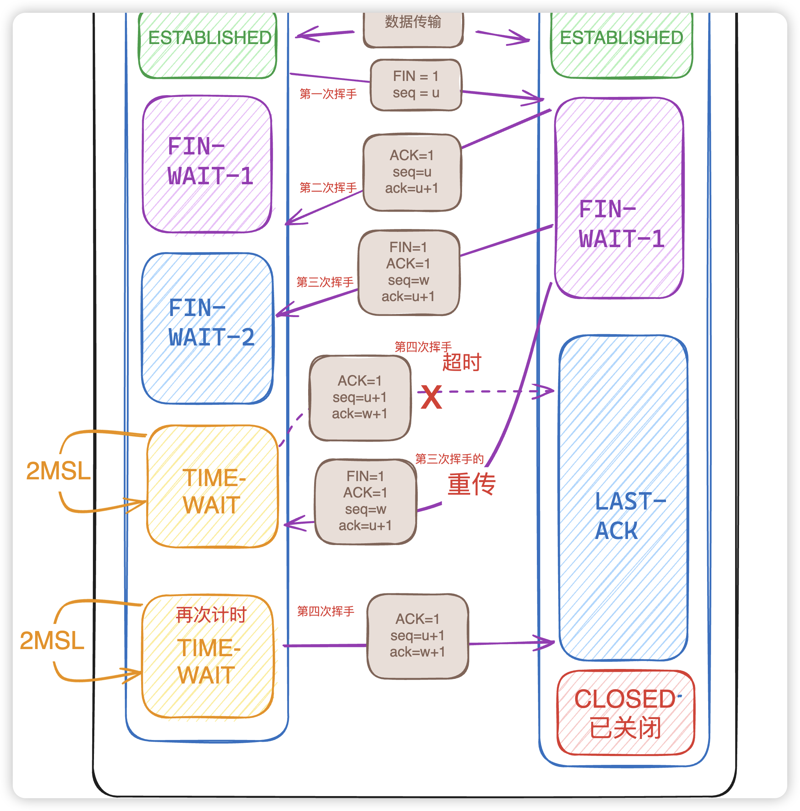

# 写在前面
### 当这个教程结束你能拥有
- 一台在世界某个地方的linux服务器
- 通过这台服务器科学上网（访问外网）
- 在这台服务器上运行一个C语言写的程序提供网页服务
- 你会拥有一个网址通过它来访问你的网站
- 学会创建项目和如何使用简单的git命令管理你的项目
# 网页简介
我们上网会先打开浏览器输入一个网址，浏览器会把这个网址装进http报文发送给dns服务器，这个dns服务器记录着**网址->IP**的映射关系，他会把对应的IP地址返回给你的浏览器，浏览器再把IP写进http报文发到（经过交换机）路由器（我们的网络其实就是世界各地的无数台路由器之间相互连接组成的巨大数据转发线路网），路由器查看他的路由转发表,转发表是一种**网址->路由出口**的映射关系表，就相当于是一张地图，指导着流量转发的方向。当报文发送到你的服务器后，服务器会查看端口号，发现是80（80是http默认端口号，当然你可以填其他，但是要和你的C程序中设置的一样）（当然建立TCP连接的时候要经历三次握手）就知道这是给你的C程序的。C程序拿到报文后开始解析http报头，比如报头是get img.png就知道是浏览器想要浏览你服务器上存储的img.png图片，然后C程序将img.png放进报文发送给浏览器。浏览器拿到图片后就会显示到界面上。（最后关闭tcp连接要进行四次挥手）



## 网络
计算机网络被分为七层或四层




## 套接字（socket）是什么，tcp是什么
套接字和TCP的关系
套接字是接口，TCP是协议。接口就是提供函数来进行有关TCPd的代码操作
当你用socket()函数创建一个套接字，并指定类型为SOCK_STREAM时，你就获得了一个TCP套接字。
所有的TCP通信（连接、收发数据、断开连接）都要通过套接字来完成，套接字负责和操作系统、TCP协议栈进行交互。
```c
int serv_sock = socket(PF_INET, SOCK_STREAM, 0);
```   
简单的解释，tcp套接字就是你的浏览器和提供网页的服务器直接进行的连接，它封装了刚才提到的网络的传输层，它就像一部电话座机，你拨通了电话就相当于建立了和电话另一头那个人的连接，你对着话筒说话就相当于发信息，那个人用耳朵听话筒就相当于接收信息，至于你们的对话转换的电信号是怎么进入信道，又是怎么拨号到电缆调制解调器，又是怎么在电话运营商的电缆调制解调器端接系统上处理发到你朋友的住宅的，都不是电话要管的。TCP就是如此，他只运行在传输层，上面的应用层究竟是在访问网页HTTP协议，还是在玩游戏，看视频，还是在SSH连接服务器，还是下面的网络层的路由器是如何维护一张分布式地图来指导流量转发，还是链路层的交换机是如何维护局域网的，还是物理层的光纤是怎么传输数据的，**TCP统统不管！**，但是他还提供电话座机无法提供的服务，那就是**可靠传输！**想象一下你在电话刚刚发明的时代，或者通话时受到电磁干扰，或在偏远郊区信号不好，你在电话中对话是会听到对方的声音变成了沙沙声，甚至听不清他、她在说什么，这对于需要完整数据传输的计算机应用来讲**相当致命**，就比如在股票交易时出错而造成经济损失，但是tcp他能确保你的数据能可靠的传输，不会出现错误。这时你肯定有疑问，tcp不是管不了上层和下层的网络吗，要是他们出错了怎么办？确实，tcp管不了它们，而且相对于tcp的上下层网络往往不提供可靠传输服务，tcp是靠着检查到达的流量是否完整，否则要求重新传输达到的，tcp还提供了别的服务保障传输的效率和可靠（- 可靠传输（重传、确认）- 流量控制（滑动窗口）- 拥塞控制（慢启动、拥塞避免）- 连接管理（三次握手、四次挥手）- 数据分段和重组）。

## 可靠传输
我们先要知道TCP是保障可靠传输的基本，seq（Sequence Number）和ack（Acknowledgment Number）,seq是tcp报文中指示字节位置的数字，比如一个1500字节的数据，分成15个tcp报文传输，在第一个报文填写2333的情况下,第二个报文就要填写2333+100=2433,第三个填2533依次类推，最后一个填写2333+1500-100=3733。虽然是指示字节位置的变量但是即使是最开始的那个数据包也不一定会填写0，而是填一个随机生成的数据，这么做的目的是防止存在之前遗留在网络中的包干扰。然后就是ack，当一端受到seq=x的包后，会在返回的包中填写ack=x+sizeof（seq=x的包），表示我已收到x字节之前的所有数据，我期待你发送从x+sizeof（seq=x的包）字节开始的其他数据。

下面我构造一个例子帮助大家理解依靠seq和ack的可靠传输（重传，确认）机制。
1. 客户端接收了seq=500的包（假设每个包100字节）
2. 客户端给服务端发送ack=600（表示期望下一个字节从600开始）
3. 客户端接收了seq=600的包
4. 客户端给服务端发送ack=700
5. **网络丢包** - seq=700的包在传输中丢失了
6. 客户端接收了seq=800的包，发现跳过了700-799字节的数据
7. 客户端**立即**发送ack=700（重复发送之前的ACK），表示：我仍然期待从字节700开始的数据
8. 服务端继续发送seq=900, seq=1000...的包
9. 客户端对**所有后续包**都回复ack=700（重复ACK），明确表示缺失700-799的数据
10. 当服务端收到**3个重复的ack=700**时，立即触发**快速重传**机制，重新发送seq=700的包
11. 客户端接收到重传的seq=700包
12. 客户端将缓存的乱序包（seq=800, 900, 1000...）重新组装
13. 客户端发送ack=1100，确认已收到所有数据到1099字节

时间轴：

T1: 发送 seq=500 (100字节) → 收到 ack=600 ✅

T2: 发送 seq=600 (100字节) → 收到 ack=700 ✅  

T3: 发送 seq=700 (100字节) → 丢包！❌

T4: 发送 seq=800 (100字节) → 收到 ack=700 (第1个重复ACK)

T5: 发送 seq=900 (100字节) → 收到 ack=700 (第2个重复ACK)

T6: 发送 seq=1000(100字节) → 收到 ack=700 (第3个重复ACK)

T7: 触发快速重传！重发 seq=700

T8: 收到重传的 seq=700 → 发送 ack=1100 (跳跃确认)

## 三次握手是什么



三次握手建立在服务器正在监听并拉取客户端连接请求，客户端请求和服务器建立连接时

```c
int s = accept(serv_sock, (struct sockaddr*)&clnt_adr, &clnt_adr_size);
```

就像你去你朋友家做客
1. 你敲门，你好请问你在家吗，可以给我开下门吗
2. 你朋友：我在，这就给你开门
3. 你回答：那太好了，我进来了，打扰拉！！！

1. 客户端发送SYN（Synchronize）包，seq填写x=ISN：初始化序列号（initial sequence number）
2. 服务端发送SYN（Synchronize）包，seq填写y=填写ISN：初始化序列号（initial sequence number）这个ISN和客户端发的相同，用来确认连接在双方之间，ack填写x+1（虽然没有具体数据，但是还是要填写ack=x+1）
3. 客户端发送正常数据包ack=y+1，seq=x+1，连接建立

**为什么要三次握手？**

**核心目的：确保双方都具备发送和接收能力，并且同步初始序列号**

让我们分析每次握手验证了什么：

**第一次握手（客户端发送SYN）：**
- 客户端：证明自己有发送能力
- 服务端：证明自己有接收能力
- 但此时服务端不知道客户端能否接收

**第二次握手（服务端发送SYN+ACK）：**  
- 服务端：证明自己有发送能力
- 客户端：证明自己有接收能力（收到了服务端的回复）
- 客户端：确认服务端有接收和发送能力
- 但此时服务端仍不知道客户端能否接收

**第三次握手（客户端发送ACK）：**
- 服务端：确认客户端有接收能力（收到了客户端的确认）
- 服务端：确认客户端有发送能力
- **此时双方都确认了对方的收发能力**

**为什么不能是两次握手？**

如果只有两次握手，会出现**半连接问题**：
场景：网络延迟导致的问题
1. 客户端A发送连接请求1（延迟在网络中）
2. 客户端A超时，发送连接请求2并成功建立连接
3. 连接2正常工作并关闭
4. 延迟的请求1到达服务端
5. 服务端回复同意连接1
6. 如果只有两次握手，服务端会等待数据，但客户端不会发送
7. **资源浪费！**

**为什么不需要四次握手？**

三次握手已经足够确认：
- ✅ 客户端能发送（第1次握手证明）
- ✅ 客户端能接收（第3次握手证明，因为它收到了第2次握手才能发送第3次）  
- ✅ 服务端能接收（第1次握手证明）
- ✅ 服务端能发送（第2次握手证明）
- ✅ 双方ISN同步完成

## 四次挥手是什么




1. 客户端主动关闭时，客户端发送FIN(Finish)包，告诉服务器我要关闭了，seq=u
2. 服务器确认客户端的关闭，ack=u+1,seq=v
3. 服务器也告诉客户端它要关闭，seq=w，ack=u+1
4. 客户端确认关闭，seq=u+1，ack=w+1



我们注意在第4步客户端发送确认后不会立即关闭，而是会等待两个MSL(Maximum Segment Lifetime)。MSL是报文在网络上能存活的最长时间，超过这个时间的包将会被路由器丢弃。

**为什么要等待2MSL？**

1. **确保最后的ACK能够到达服务端**：
   - 如果服务端没收到最后的ACK，会重传FIN包
   - 客户端需要能够接收并重新回复ACK
   - 1个MSL保证ACK到达服务端，1个MSL保证重传的FIN能到达客户端

2. **防止旧连接的数据包干扰新连接**：（假设你不小心关掉了客户端又立马打开）
   - 等待2MSL确保网络中所有属于该连接的包都失效
   - 避免新连接误接收旧连接的延迟数据包

**为什么要四次挥手？**

TCP连接是**全双工**的，需要分别关闭每个方向的数据传输：

**关键概念：TCP连接 = 读通道 + 写通道**

```
客户端 ←─────读通道────── 服务端
客户端 ──────写通道─────→ 服务端
```

四次挥手的本质：
1. **第1次挥手**：客户端关闭写通道（不再发送数据）
2. **第2次挥手**：服务端确认客户端的写通道关闭
3. **第3次挥手**：服务端关闭写通道（不再发送数据）  
4. **第4次挥手**：客户端确认服务端的写通道关闭

**为什么不能像握手一样合并为3次？**

因为中间可能有**数据传输的时间差**：
- 客户端发送FIN：我不发数据了
- 服务端回复ACK：好的，我知道了
- **服务端可能还有数据要发送给客户端**（比如传输文件还没完成）
- 服务端发送FIN：我也不发数据了
- 客户端回复ACK：好的，连接完全关闭

这种设计支持**优雅关闭**：
```c
// 客户端只关闭写方向，还能接收数据
shutdown(socket, SHUT_WR);  // 发送FIN，但还能接收

// 服务端继续发送剩余数据...
// 客户端继续接收剩余数据...

// 最终complete关闭
close(socket);
```

# 正式开始

### 获取服务器
我们要在Airofoft Azure上白嫖一台服务器

<del>我懒得放图片了，不懂自己去b站找教程，仅放出步骤指路</del>

<del>我要赶紧搞完这个项目，之后教大家搞GPU实时光线追踪</del>

- 你要申请github的学生认证，github打不开下载steam++加速
- 你要在你的电脑上安装ssh或者xshell，我默认你的电脑是windows
- 在github的学生包里找到Airofoft Azure，关联github账户，最好把Copilot和域名也白嫖了
- 在日本或者韩国或者香港这些离你近的地方搭建Ubuntu(linux)虚拟机
- 用ssh或者xshell连接你的服务器
- 在虚拟机上安装ss脚本
- 在你的windows上安装ss客户端，这样你就可以访问外网了

### 开发环境搭建
我们在windows上搭建linux环境，为了使用本地vscode和git，当然你要是不嫌弃服务器上的vim就不用搞
- 在你的windows上安装wsl
- wsl里面安装ss客户端，这样你的本地linux也能访问外网了，这是为了连接github
- 在wsl里面启动vscode，用code .命令