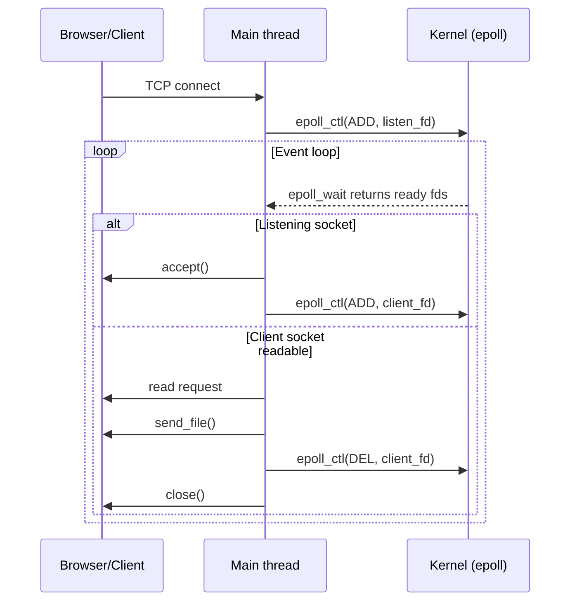

# Epoll Static Web Server Handbook

> This guide assumes you already tried the Part1 multi-threaded version. Here we rebuild the same static web server using `epoll` and non-blocking I/O. For the Chinese edition, see [《Mini Web Server（Epoll 版）全栈学习手册》](tutorial.md).

## Table of Contents

- [Project Overview](#project-overview)
- [Getting Started Quickly](#getting-started-quickly)
- [Architecture and Event Flow](#architecture-and-event-flow)
- [Code Walkthrough](#code-walkthrough)
- [Front-End & Static Assets](#front-end--static-assets)
- [Suggested Exercises](#suggested-exercises)
- [Troubleshooting](#troubleshooting)
- [Glossary](#glossary)
- [Further Reading](#further-reading)

## Project Overview

- **Purpose**: Demonstrate how a single-threaded server can handle many HTTP clients by leveraging I/O multiplexing (`epoll`).
- **Language**: C (C11 recommended).
- **Core idea**: The main thread blocks inside `epoll_wait`, reacts to incoming events, and sends static files directly to the browser.
- **Who is it for?** Developers who have written a threaded HTTP server and want to understand the event-driven alternative.

Once the binary is running it serves the files that live next to the executable—`learn.html`, `im.png`, and any other static assets you add.

## Getting Started Quickly

### Repository Layout

```
part2--Epoll_Server/
├── learn.html           # Default landing page
├── im.png               # Sample image
├── myweb.c              # Main source file (focus of this guide)
├── myweb                # Compiled binary (after gcc)
├── myweb_test           # Optional experimental binary
└── tutorial/            # Documentation (this folder)
```

### Build

Make sure GCC is available:

```bash
gcc -std=c11 -O2 -Wall myweb.c -o myweb
```

> Add `-g` to include debug symbols. Building on macOS? Consider using a Linux VM or porting the event loop to `kqueue`.

### Run the server

```bash
./myweb 8080
```

Expected console output:

```
Mini HTTP server running on port 8080 ...
```

### Visit from a browser

- `http://127.0.0.1:8080/` → serves `learn.html`.
- `http://127.0.0.1:8080/im.png` → verifies binary transfers & content-type headers.
- `http://127.0.0.1:8080/nope.html` → returns the built-in 404 page.

### Stop the server

Press `Ctrl + C` in the terminal.

## Architecture and Event Flow

Even though there is only one thread, the kernel helps us observe many sockets at once. The control flow looks like this:



- **Listening socket**: Watch for new connections and register the resulting client sockets.
- **Client sockets**: When data arrives the main loop reads, parses the request, writes the response, and closes the connection.
- **Non-blocking mode**: `setnonblockingmode` guarantees that `accept`/`read` never stalls the event loop.

For a static file server this model is perfect: each connection follows a simple “GET once → send file → close” pattern.

## Code Walkthrough

All heavy lifting lives in `myweb.c`.

### 1. Entry point `main`

- Validates the CLI arguments (expects a single `port`).
- Creates the listening socket, enables `SO_REUSEADDR`.
- Binds to `INADDR_ANY:port` and `listen`s.
- Creates an `epoll` instance, registers the listening socket with `EPOLLIN`.
- Enters an infinite loop: `epoll_wait` → iterate ready events →
  - `serv_sock`: `accept`, make the client socket non-blocking, `epoll_ctl(ADD)`.
  - otherwise: hand the fd to `request_handler`, then `epoll_ctl(DEL)`.

### 2. `setnonblockingmode`

Thin wrapper around `fcntl` to flip the `O_NONBLOCK` bit.

### 3. HTTP helpers

- `guess_mime`: infers `Content-Type` based on file extension.
- `send_headers` / `send_body_mem`: centralizes HTTP response emission.
- `send_400`, `send_404`, `send_405`: pre-built error pages for Bad Request, Not Found, Method Not Allowed.
- `send_file`: verifies the file is regular, opens it, streams the contents while setting a correct `Content-Length`.

### 4. Safe path handling `sanitize_path`

- Strips query strings (`?` onwards).
- Removes the leading slash; empty path becomes `learn.html`.
- Blocks `..` to prevent directory traversal.
- Copies the sanitized value into `out_path`.

### 5. Request handling `request_handler`

1. Wraps the file descriptor with `fdopen` for buffered I/O.
2. Reads the request line and validates the format (must contain `HTTP/`).
3. Splits method, URL, and version via `sscanf` (only `GET` is allowed).
4. Skips over the remaining headers (reads until a blank line).
5. Sanitizes the URL and serves the mapped file via `send_file`.
6. Closes both streams (which closes the underlying fd).

> This classroom implementation assumes an entire request line fits into the buffer and ignores request bodies. Production servers should parse line by line and enforce header limits.

### 6. Epoll event loop

- `epoll_wait` returns an array of ready events.
- For each event:
  - listening fd → accept + register the new client.
  - client fd → handle the request, then remove & close.
- The current code uses level-triggered epoll. If you want to support keep-alive or large downloads you can extend it with a per-connection state machine and `EPOLLOUT`.

## Front-End & Static Assets

- `learn.html`: demo page to test HTML delivery.
- `im.png`: verifies binary transfers.
- Drop any extra CSS/JS/fonts alongside these files and the server will happily serve them.
- Update `guess_mime` if you add new file types.

## Suggested Exercises

1. **Keep-alive support**
   - Update the response headers and connection lifecycle to honor `Connection: keep-alive`.
   - Requirement: handle multiple requests on the same fd.
2. **Directory index**
   - When the sanitized path is a directory, generate a simple HTML listing or fall back to `index.html`.
3. **Access logging**
   - Print `method path status duration` to the console for each request.
4. **Connection limit**
   - Track active connections and reject new ones beyond a threshold to simulate resource protection.

## Troubleshooting

| Symptom | Likely cause | Fix |
| --- | --- | --- |
| Browser hangs | Missing `Content-Length` or file not closed | Ensure `send_headers` runs and the file is fully streamed |
| Garbled non-HTML response | MIME type not recognized | Extend `guess_mime` with the new extension |
| `Too many open files` | Connections left open | Confirm `request_handler` closes both streams |
| Able to read arbitrary files | Path sanitation missing | Keep the `..` check and optionally restrict to a static root |

## Glossary

| Term | Definition | Relevant code |
| --- | --- | --- |
| Multiplexing | Watching many I/O sources from one loop | `epoll_wait` | 
| Non-blocking I/O | Calls return immediately instead of waiting | `setnonblockingmode` |
| `epoll_ctl` | Register/modify/remove a file descriptor | Event loop in `main` |
| `fdopen` | Wrap an fd into a stdio `FILE*` stream | `request_handler` |
| MIME | Describes the payload type in HTTP headers | `guess_mime` |

## Further Reading

- *Linux High Performance Server Programming* — excellent deep dive into `epoll` and event-driven servers.
- nginx source (`src/event/ngx_epoll_module.c`) for a production-grade reference.
- `libevent` / `libuv` as portable event loop abstractions.
- Try `strace` or `perf` to inspect syscalls and performance hot spots.

> After mastering this tiny example you're ready to tackle Part3, which layers on a database, templates, and a front-end SPA.
