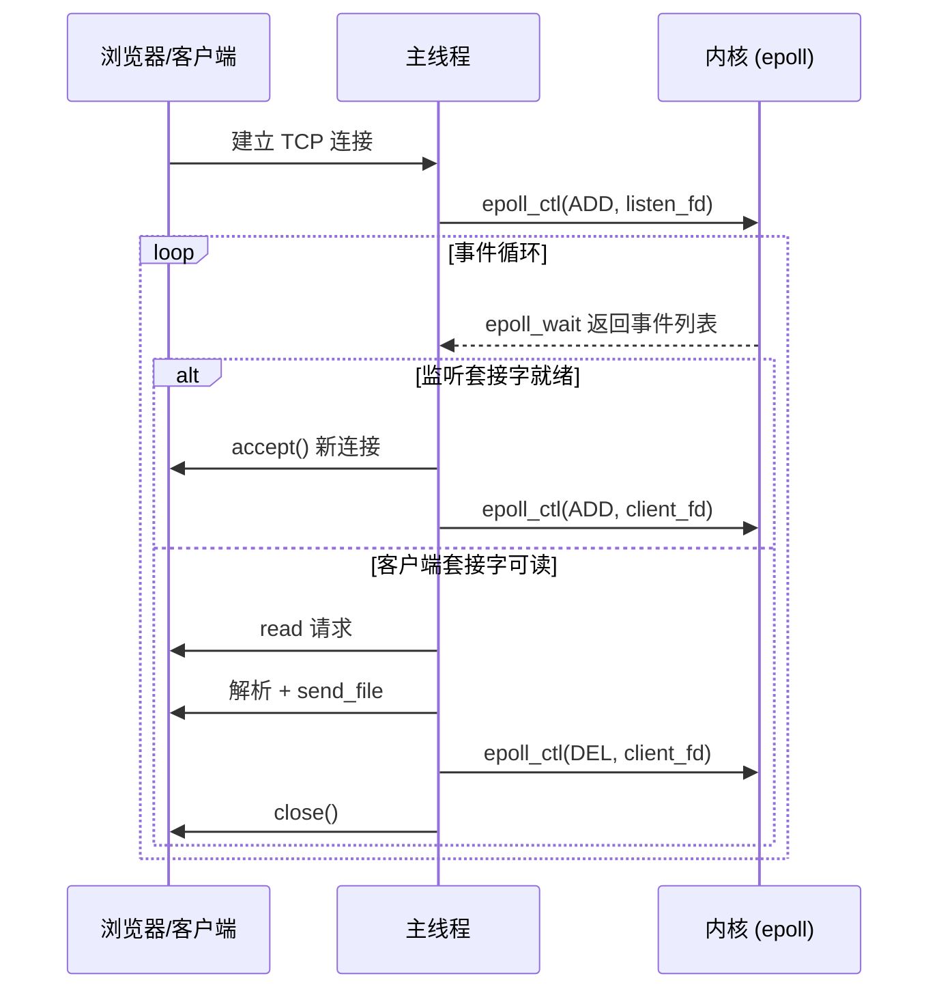

### 上一章的EPOLL版本

## epoll是什么?

epoll就是一种多路复用技术，什么是多路复用？

大家都知道无线电在发射的时候会向整个空间震荡，那么如果别人也要发无线电不是就和我发射的撞车了吗，那为什么收音机可以收到那么多电台呢？

聪明的你已经发现了，每个不同的电台发射的无线电波的频率是不同的，这样就可以在收音机中解调（学过物理的都懂，内部的电路会放大某个频率从而实现接收特定频率的电磁波）

这样在一整个空间中就可以发送不同的信号，互不干扰，这就是多路复用技术

回想一下我们part1是怎么实现多人访问的，我们在主线程监听客户端的连接请求，
```int s = accept(serv_sock, (struct sockaddr*)&clnt_adr, &clnt_adr_size);```一旦连上就新创建一个线程去处理``` if (pthread_create(&t_id, NULL, request_handler, ps) != 0) ```

但是对于我们这种静态托管（只处理服务器的get请求，发送服务器想get的文件）只需要把我们的http网页发给服务器，发送http（io）的开销远小于创建线程的开销，即使是创建线程池避免创建线程也需要考虑线程上下文切换，锁的获取与释放，我们的html要达到200kb才能体现出多线程的优势，还有一点是我们可能很穷，买的服务器就只有一个核心，这样子不如在主线程处理所有人的连接

epoll就是如此

## epoll的工作原理

epoll其实是把我们的服务socket和客户socket都注册给系统，当出现消息（服务socket的：有新客户请求连接，请处理；客户socket的：我想请求消息请给我发送）就会注册进消息数组通知主线程处理

## 核心架构与事件流

整个服务器只有一个主线程，但借助内核的 `epoll` 实现“多路复用”。核心事件流如下：



- **监听套接字**：负责接收新连接；只需要在循环中处理 `EPOLLIN` 事件。
- **客户端套接字**：当内核发现有数据可读时触发事件；主线程读取请求，解析后直接响应并关闭连接。
- **非阻塞模式**：`setnonblockingmode` 确保无论 `accept` 还是 `read` 都不会阻塞主线程。

这种设计对静态资源服务器很适合：每条连接只有一次 GET 请求，响应完立即关闭，无需维护复杂状态。

## 源码逐段拆解

核心代码位于 `myweb.c`，关键模块如下。

### 1. 启动入口 `main`

```c
int main(int argc, char* argv[])
```

- 校验命令行参数（端口号）。
- 创建监听套接字，设置 `SO_REUSEADDR`。
- 绑定到 `INADDR_ANY:port` 并调用 `listen`。
- 创建 `epoll` 实例，将监听套接字注册为 `EPOLLIN`。
- 进入无限循环调用 `epoll_wait`，按事件类型分发：
  - `serv_sock`：调用 `accept`，对新连接设置非阻塞，再 `epoll_ctl(ADD)`。
  - 其他 fd：调用 `request_handler` 处理请求，并在返回后 `epoll_ctl(DEL)`。

### 2. `setnonblockingmode`

封装 `fcntl`，将文件描述符设为非阻塞，避免单个阻塞调用卡住整个事件循环。

### 3. HTTP 工具函数

- `guess_mime`：根据文件扩展名推断 `Content-Type`。
- `send_headers` / `send_body_mem`：统一输出响应头与响应体。
- `send_400` / `send_404` / `send_405`：生成常见错误响应（Bad Request / Not Found / Method Not Allowed）。
- `send_file`：
  - 使用 `stat` 校验文件存在且是普通文件。
  - 打开文件，按块读取并写入客户端流。
  - 根据文件大小设置 `Content-Length`，方便浏览器快速加载。

### 4. 安全处理路径 `sanitize_path`

- 移除查询字符串（`?` 后内容）。
- 去掉前导 `/`，空路径映射为 `learn.html`。
- 检查是否包含 `..`，防止目录穿越攻击。
- 其余情况直接映射为本地文件路径。

### 5. 请求处理 `request_handler`

这段函数承担“解析 HTTP + 回送文件”的主要责任：

1. 用 `fdopen` 将文件描述符包装为读写流，方便使用 `fread`/`fprintf`。
2. 读取请求行，校验是否包含 `HTTP/`。
3. 使用 `sscanf` 拆出 `method`、`url`、`version`：
	- 仅允许 `GET`，其余返回 `405`。
4. 丢弃剩余头部（简单循环读取到空行）。
5. 调用 `sanitize_path` + `send_file` 返回文件内容。
6. 收尾关闭读写流（会影响底层 fd）。

> 注意：该实现只支持无正文的 GET 请求，且一次性读取请求行，对于生产环境应扩展为按行读取（`fgets`）并限制头部大小。

### 6. epoll 事件循环

- `epoll_wait` 返回就绪事件数组。
- 遍历每个事件：
  - 若是 `serv_sock`，说明有新连接；接受并注册。
  - 否则将 fd 交给 `request_handler` 后立即从 epoll 中移除并关闭连接。
- 采用水平触发（Level Trigger）；若未来要处理长连接或大文件，可考虑 `EPOLLOUT` 与更细致的状态机。

## 前端与静态资源

- `learn.html`：示例页面，展示服务器能正确返回 HTML 和内联 CSS。
- `im.png`：用于测试图片响应头与二进制传输。
- 你可以将其它静态文件（CSS/JS/字体）放在同目录，直接通过 URL 访问。
- MIME 类型由 `guess_mime` 控制，若新增文件类型可在函数中补充扩展名。

## 实验任务建议

1. **支持 keep-alive**：
	- 修改响应头与请求处理逻辑，实现对 `Connection: keep-alive` 的简单支持。
	- 需求：在同一个 fd 上处理多次请求。
2. **支持目录索引**：
	- 当请求路径对应目录时，自动列出目录下的文件（或返回默认 `index.html`）。
3. **增加访问日志**：
	- 在终端打印 `method path status cost`，便于调试。
4. **限制并发数量**：
	- 为活跃连接计数，超过阈值时拒绝新连接，学习资源保护策略。

## 常见问题排查

| 症状 | 可能原因 | 解决办法 |
| --- | --- | --- |
| 浏览器长时间加载 | 响应头缺少 `Content-Length` 或文件未关闭 | 检查 `send_headers` 是否被调用、文件是否成功读取 |
| 访问非 HTML 文件乱码 | `guess_mime` 未覆盖该扩展名 | 在 `guess_mime` 中添加 MIME 映射 |
| 终端报 `Too many open files` | 大量连接未关闭 | 确认 `request_handler` 末尾 `fclose` 是否执行 |
| 访问者可读取任意文件 | `sanitize_path` 防护不足 | 保持 `..` 过滤逻辑，必要时限制静态目录 |

## 术语速查表

| 术语 | 解释 | 关联代码 |
| --- | --- | --- |
| 多路复用（Multiplexing） | 单线程监听多个 I/O 事件 | `epoll_wait` 主循环 |
| 非阻塞 I/O | 调用立即返回，不等待数据 | `setnonblockingmode` |
| `epoll_ctl` | 向 epoll 注册/修改/删除监听项 | `main` 循环中添加/删除 fd |
| `fdopen` | 将文件描述符包装成标准 I/O 流 | `request_handler` |
| MIME | HTTP 告知浏览器文件类型的头部 | `guess_mime` |

## 进阶延伸阅读

- 《Linux 高性能服务器编程》：第 6 章详细讲解 `epoll` 及事件处理模式。
- nginx 事件驱动模型：可以对照 `src/event/ngx_epoll_module.c` 学习工业级实践。
- `libevent` / `libuv`：了解更高层的事件库封装方式。
- 使用 `strace` 或 `perf` 观察服务器的系统调用与性能瓶颈。

> 学会这个最小化示例后，你可以继续挑战 Part3，构建带数据库和模板引擎的完整版邮件系统。

